## The Calibration Challenge

<!-- **Stochastic simulation model, observed data - find optimal parameter set** -->

::: {.columns .two-wide-narrow-panel}
::: {.column}
**Setup:** simulator $y = f(\theta) + \varepsilon$, observed data $y_\text{obs}$

**Optimization view**

Minimize a discrepancy $D(\theta) = d\!\left(\bar{f}(\theta),\, y_\text{obs}\right)$:

$$\theta^* = \arg\min_{\theta \in \Theta}\; D(\theta)$$

**Posterior inference view**

Treat $\theta$ as random; update beliefs via Bayes' rule:

$$\pi(\theta \mid y_\text{obs}) \;\propto\; L(y_\text{obs} \mid \theta)\; \pi(\theta)$$

Both require [**many**]{.hl-red} simulator evaluations at many $\theta$ values.
:::
::: {.column}
**Why is this hard in practice?**

- Models are [**expensive**]{.hl-red} — each run takes minutes to hours on HPC
- Likelihoods are [**intractable**]{.hl-red} — no closed-form expression
- Models are [**stochastic**]{.hl-amber} — same $\theta$, different output every run
- Need many runs per $\theta$ just to see through the noise
- Traditional calibration wastes most of the compute budget
:::
:::

## Why Trajectories? The Case Against Averaging

**Same parameters, different outputs — every single run**

::: {.columns}
::: {.column width="50%" }
In a stochastic simulator:

$$y = f(\theta), \quad r \sim \text{Uniform}$$

where $r$ is a [**random seed**]{.hl-amber} governing the stochastic path.

- Two runs with identical $\theta$ but different $r$ can look very different
- The [**average**]{.hl-red} trajectory may never actually occur
- Averaging masks multimodality and loses the connection between parameters and specific epidemic paths

::: {.highlight-box}
**Key shift:** instead of finding the best $\theta$, find many $(\theta, r)$ pairs that produce data-consistent [**trajectories**]{.hl-blue}.
:::
:::
::: {.column width="50%"}
::: {.r-stack}
::: {.fragment .fade-out fragment-index=1}
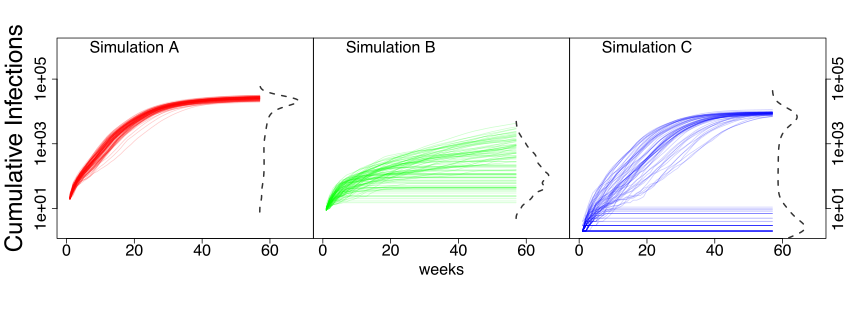{width="100%"}
:::
::: {.fragment .fade-in fragment-index=1}
A [**trajectory**]{.hl-blue} is a single model realization:

$$y(\theta, r) = f(\theta, r)$$

A [**good trajectory**]{.hl-green} satisfies:
$$\text{RMSE}(y(\theta, r),\ y_\text{obs}) < \delta$$

**Why ensembles of trajectories?**

- Enables ensemble forecasting from calibrated runs
- Supports trajectory continuation when new surveillance data arrives
- More honest about model uncertainty
:::
:::
:::
:::

## What Existing Methods Lack

::: {.columns}
::: {.column width="50%"}
[**Approximate Bayesian Computation**]{.hl-blue}

- Simulate, compare to data via summary statistics
- Accept/reject based on distance threshold
- [**Gap:**]{.hl-red} summary statistics discard trajectory-level information
:::
::: {.column width="50%"}
[**Emulation + Calibration**]{.hl-blue}

- Build surrogate of $\mathbb{E}[f(\theta)]$ - non-replicate aware
- Optimize over $\theta$
- [**Gap:**]{.hl-red} averaging over seeds before emulation loses the stochastic structure
:::
:::

::: {.callout}
All existing methods [aggregate over randomness]{.hl-red}. The best-average parameters need not produce any data-consistent trajectory.
:::

**The consequence:** with a fixed compute budget, mean-based surrogates return a handful of trajectories that *happen* to be close to data — they are not searching for trajectories explicitly.

## Trajectory-Oriented Optimization (TOO)

::: {.columns .two-wide-narrow-panel}
::: {.column}
**Augment the input space:**

Instead of $f(\theta)$, model $f(\theta, r)$ — treating the [random seed $r$]{.hl-amber} as an explicit input alongside parameters $\theta$.

- Now the simulator is a **deterministic function** of $(\theta, r)$
- We can build a surrogate over the joint $(\theta, r)$ space
- We search for good $(\theta, r)$ pairs, not just good $\theta$

This is the [**Common Random Numbers (CRN)**]{.hl-blue} idea, extended to the calibration setting [@chen2012].
:::
::: {.column}
**Two ingredients needed:**

1. [**Surrogate model**]{.hl-purple} — emulates individual realizations $f(\theta, r)$; must respect seed structure

2. [**Optimization algorithm**]{.hl-purple} — searches the joint $(\theta, r)$ space efficiently under a limited simulation budget

::: {.highlight-box}
Finding good $(\theta, r)$ pairs = [**trajectory discovery**]{.hl-blue}, not just parameter estimation.
:::
:::
:::

## Common Random Numbers (CRN)

**Key insight: fixing the seed makes $f(\theta, r)$ smooth in $\theta$**

::: {.columns}
::: {.column width="60%"}
- Fix seed $r = r_0$, vary $\theta$ across its domain
- The output $f(\theta, r_0)$ [varies smoothly]{.hl-green} with $\theta$
- A GP can interpolate this smooth function accurately
- Repeat for many seeds: each gives a "slice" of the output surface

::: {.highlight-box}
[CRN]{.hl-blue} converts a noisy, non-smooth calibration surface into a collection of [smooth functions]{.hl-green} — one per seed.
:::
:::
::: {.column width="40%"}
**Practical benefit:**

- Far fewer simulations needed to learn the surface
- Reuse the same seeds across parameter values
- Enables variance reduction via control variates
- Standard in simulation optimization literature
:::
:::

::: {.highlight-box .fragment}
**Our choice of surrogate:** a [**Gaussian Process (GP)**]{.hl-blue} fitted over the joint $(\theta, r)$ space — exploiting CRN smoothness to interpolate individual trajectories efficiently.
:::

## Gaussian Process: A Brief Primer

::: {.columns}
::: {.column width="45%"}
A [**Gaussian Process**]{.hl-blue} defines a distribution over functions:

$$z(x) \sim \mathrm{GP}\!\left(m(x),\; k(x, x')\right)$$

- $m(x)$: mean function (often $\equiv 0$)
- $k(x, x')$: [**kernel**]{.hl-amber} — encodes output similarity as a function of input distance
- **RBF kernel:** $k(x, x') = \exp\!\left(-\|x - x'\|^2 / 2\ell^2\right)$, where $\ell$ controls smoothness

**Posterior** at a new point $x_*$ is Gaussian:

$$z(x_*) \mid \mathrm{Data} \;\sim\; \mathrm{Normal}\!\left(\mu_*, \;\sigma^2_*\right)$$

with analytic $\mu_*$ and $\sigma^2_*$. Returns [**uncertainty**]{.hl-green} alongside predictions.
:::
::: {.column width="55%"}
```{r}
#| label: gp-primer-fig
#| fig-height: 5.5
#| fig-width: 6
source("R/GP_example.R")
set.seed(42)
x_grid <- seq(-3, 3, length.out = 150)
x_obs  <- c(-2.2, -0.8, 0.5, 1.8)
y_obs  <- sin(pi * x_obs / 2) + rnorm(4, 0, 0.08)

par(mfrow = c(2, 1), mar = c(3, 3.2, 2, 1), mgp = c(1.8, 0.5, 0),
    cex.main = 0.95, cex.axis = 0.8, cex.lab = 0.85)

# Prior
samples_prior <- sample_unconditioned_gp(
  x_grid, squared_exponential_kernel,
  list(sigma = 1.0, length_scale = 0.8), n_samples = 6)
plot_gp_samples(x_grid, samples_prior,
                title = "GP Prior: draws from the process")

# Posterior
result <- sample_conditioned_gp(
  x_grid, x_obs, y_obs, squared_exponential_kernel,
  list(sigma = 1.0, length_scale = 0.8),
  noise_var = 0.01, n_samples = 6)
plot_gp_posterior(x_grid, result$mean, result$cov, x_obs, y_obs,
                  title = "GP Posterior: conditioned on observations")
```
:::
:::

## The CRNGP Surrogate

**A Gaussian Process over the augmented $(\theta, r)$ space**

::: {.columns .two-wide-narrow-panel}
::: {.column}
The surrogate models simulator output as:

$$f(\theta, r) \sim \mathrm{GP}\bigl(\mu(\theta, r),\ k((\theta,r),(\theta',r'))\bigr)$$

**Separable covariance kernel:**

$$k\bigl((\theta,r),(\theta',r')\bigr) = k_\theta(\theta, \theta') \times k_s(r, r')$$

where the seed kernel gives [**constant inter-replicate correlation $\rho$**]{.hl-amber} when $r \neq r'$:

$$k_s(r, r') = \begin{cases} 1 & r = r' \\ \rho & r \neq r' \end{cases}$$
:::
::: {.column}
::: {.r-stack}
::: {.fragment .fade-in-then-out fragment-index=1}
[**CRNGP**]{.hl-blue} vs [**HetGP**]{.hl-red}:

- [HetGP]{.hl-red} (or any other non-replicate aware) learns a single mean surface $\mathbb{E}[f(\theta)]$ + variance
- [CRNGP]{.hl-blue} learns individual trajectory surfaces $f(\theta, r)$ per seed
- Result: [CRNGP]{.hl-blue} predicts which *specific* $(\theta, r)$ pair is good [@fadikar2023TOO]
:::
::: {.fragment .fade-in fragment-index=2}
**What this gives us:**

- Borrows strength across seeds for the same $\theta$
- [$\rho$]{.hl-amber} captures how much trajectories share structure
- Posterior predictions are fast exploiting kronecker structure in the design 
- Uncertainty at both $\theta$ and $(\theta, r)$.
:::
:::
:::
:::

## CRNGP in Practice

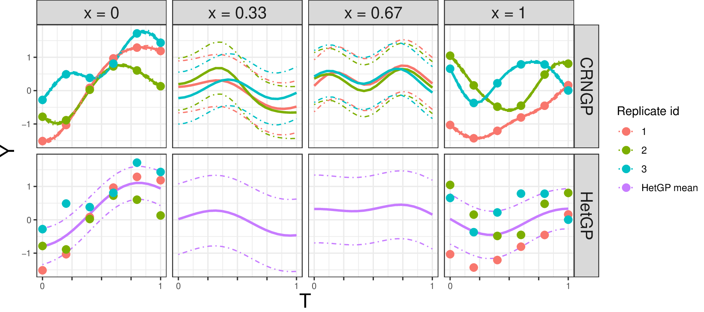{width="80%"}

## CRNGP: Role of $\rho$

::: {.columns}
::: {.column width="58%"}
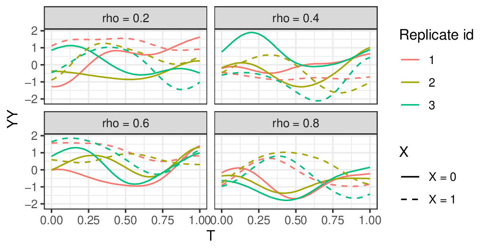{width="100%"}
:::
::: {.column width="42%"}
**The inter-replicate correlation $\rho$:**

- [$\rho$]{.hl-amber} controls how much information is [shared across seeds]{.hl-green} for the same $\theta$
- High $\rho$: trajectories from different seeds are treated as nearly exchangeable — more borrowing, smoother surface
- Low $\rho$: each seed is treated as an [independent]{.hl-blue} function — more flexibility, less borrowing
- $\rho$ is [estimated from data]{.hl-purple} via maximum likelihood, adapting to the actual seed-to-seed variability in the simulator
:::
:::

## Optimization: Thompson Sampling

**Using [CRNGP]{.hl-blue} to find good $(\theta, r)$ pairs**

::: {.columns}
::: {.column width="50%"}
**Algorithm:**

1. [**Initialize**]{.hl-purple} — run $n_\text{init}$ simulations on a Latin hypercube over $(\theta, r)$; fit CRNGP

2. [**Repeat**]{.hl-purple} until budget exhausted:
   - Draw a posterior sample $\tilde{f}$ from the [CRNGP]{.hl-blue}
   - Find $(\theta^*, r^*)$ minimizing $\|\tilde{f}(\theta, r) - y_\text{obs}\|^2$ over the candidate grid
   - Run simulator at $(\theta^*, r^*)$; update [CRNGP]{.hl-blue}

<!-- 3. [**Return**]{.hl-purple} all $(\theta, r)$ with $L(\theta, r) < \delta$ -->


:::
::: {.column width="50%"}
**Why [Thompson Sampling]{.hl-orange}?**

- Natuarally balance exploration vs exploitation
- Each draw can point to a different promising region
- Handles the multi-modal nature of the trajectory space gracefully
- Amenable to batch evaluation on HPC

**Key property:** the finite seed set $\mathrm{R} = \{r_1, \ldots, r_m\}$ makes the problem computationally tractable — we search over a discrete grid of $(\theta, r)$ pairs.
:::
:::

## Optimization: Thompson Sampling

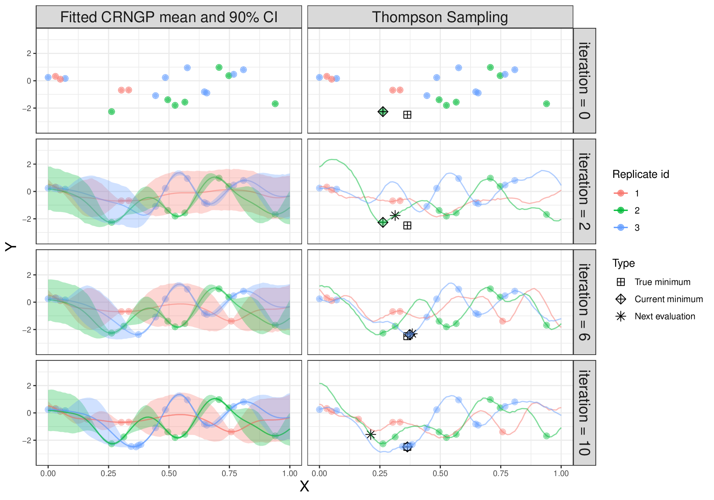{width="80%" fig-align="center"}

## Application: A COVID-19 model

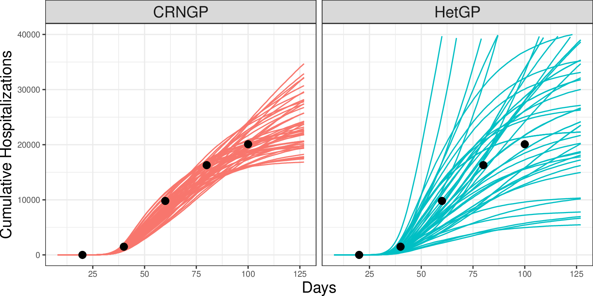{width="80%" fig-align="center"}

## Limitation : The Fixed Grid 

**[Thompson Sampling]{.hl-orange} explores well — but only where the grid lives**

::: {.columns}
::: {.column width="55%"}
In this TOO setup, the candidate grid of $(\theta, r)$ pairs is [**fixed at initialization**]{.hl-red}:

- If a promising region wasn't covered by the initial design, it won't be found
- With high-dimensional $\theta$, good regions are sparse and unlikely to be well-covered by a uniform initial design
- As the GP learns, the grid doesn't adapt — budget spent sampling from regions already known to be poor


:::
::: {.column width="45%" .fragment}

::: {.highlight-box}
**Question:** can we make the grid [*adapt*]{.hl-green} as the GP learns — focusing on promising regions dynamically?
:::
:::
:::

## Adaptive Thompson Sampling (aCRN)

**Three steps per iteration**

::: {.columns}
::: {.column width="33%"}
[**Step 1: Thompson Sampling**]{.hl-orange}

- Maintain a grid of candidate $(\theta, r)$ pairs
- Draw a sample from the GP posterior
- Select batch of points with best predicted objective
- Evaluate simulator, update GP
:::
::: {.column width="33%" .fragment}
[**Step 2a: Adaptive Grid - Filter**]{.hl-blue}

- Importance resample the grid using current objective estimates
- Concentrates candidates in high-likelihood regions
- Low-scoring $(\theta, r)$ pairs dropped
:::
::: {.column width="33%" .fragment}
[**Step 2b: Adaptive Grid - Densify**]{.hl-purple}

- Run Metropolis–Hastings steps in $\theta$ space (seeds fixed)
- Proposes new $\theta$ near existing good points
- Accepted with probability:
$$\alpha = \min\!\left\{1,\ \frac{L(\theta_\text{can}, r) \cdot q(\theta_\text{can} \mid \theta)}{L(\theta, r) \cdot q(\theta \mid \theta_\text{can})}\right\}$$
:::
:::

::: {.callout .fragment}
[Filter]{.hl-blue} + [Densify]{.hl-purple} together ensure the grid [*tracks*]{.hl-green} promising regions as the GP learns."
:::

## Adaptive Grid TOO in Practice

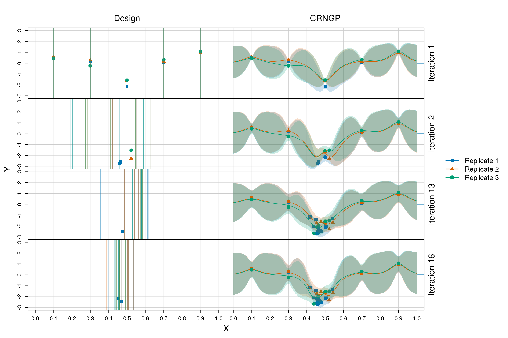{width="80%" fig-align="center"}

## Simulated Experiment: Stochastic SIR Model

**A controlled testbed to compare methods**

::: {.columns .two-wide-narrow-panel}
::: {.column}
**Model:** Discrete-time stochastic SIR with binomial transitions

- Infection rate $\beta \in [0, 1]$
- Recovery rate $\gamma \in [0, 1]$
- Trajectory: daily incidence curve

**Budget:** 300–700 simulations total

**Baselines:**

- [**fCRN**]{.hl-blue} — fixed grid, fixed seeds (no adaptation)
- [**fgCRN**]{.hl-blue} — fixed grid, flexible seeds
- [**fHet**]{.hl-red} — heteroskedastic GP (standard approach)
- [**aHet**]{.hl-red} — adaptive heteroskedastic GP
:::
::: {.column}
**Evaluation metrics:**

- Proportion of discovered trajectories with RMSE $< \delta$ (for $\delta \in \{15, 20, 25, 30\}$)
- [**rAUC**]{.hl-amber} — relative area under the proportion-vs-budget curve; higher = finds good trajectories faster
- Parameter space coverage
:::
:::

## Simulated Experiment: Stochastic SIR Model

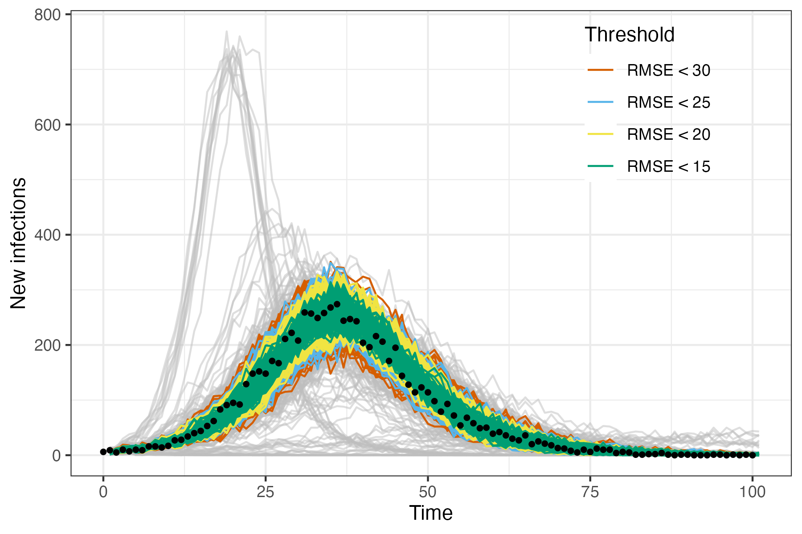{width="80%" fig-align="center"}


## Simulated Experiment: Stochastic SIR Model

### Quality of Trajectories

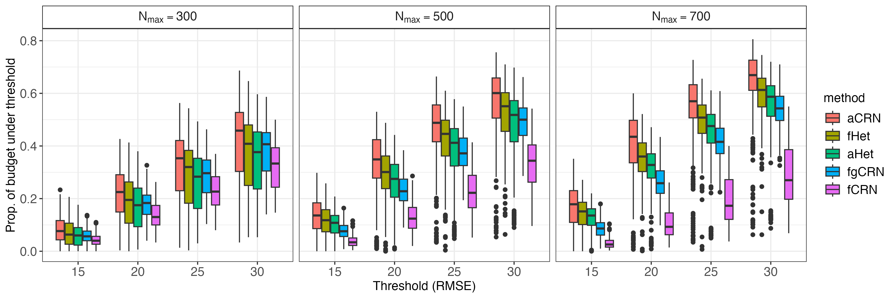{width="80%" fig-align="center"}

## Simulated Experiment: Stochastic SIR Model

### Time to Solution

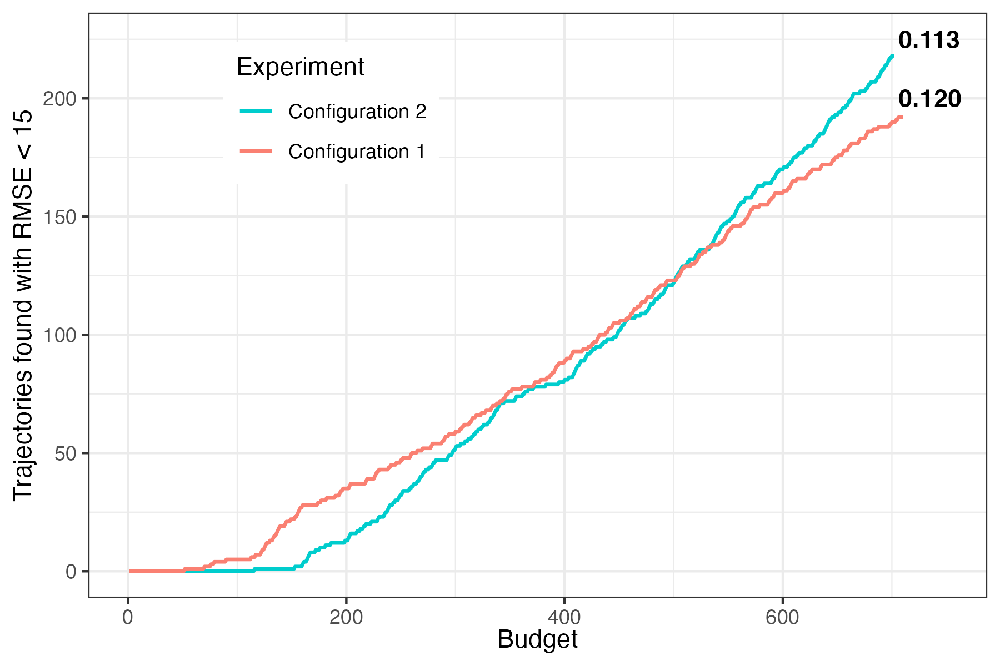{width="80%" fig-align="center"}

## Simulated Experiment: Stochastic SIR Model

### Time to Solution

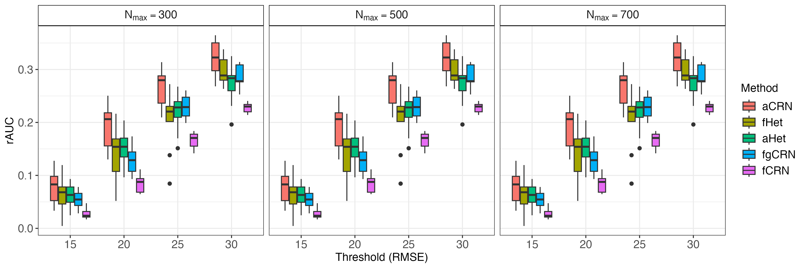{width="80%" fig-align="center"}

## Simulated Experiment: Stochastic SIR Model

### Parameter Exploration

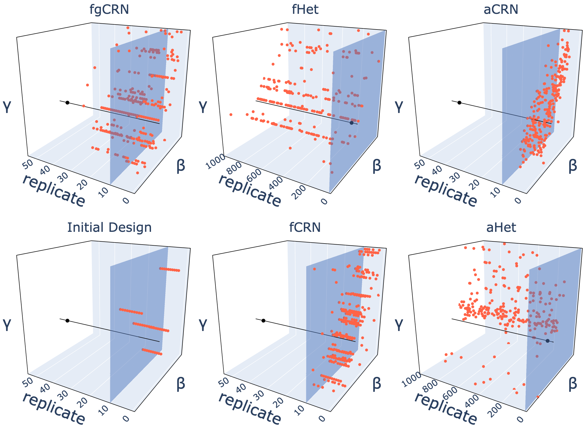{width="80%" fig-align="center"}

## Simulated Experiment: Stochastic SIR Model

### Parameter Exploration

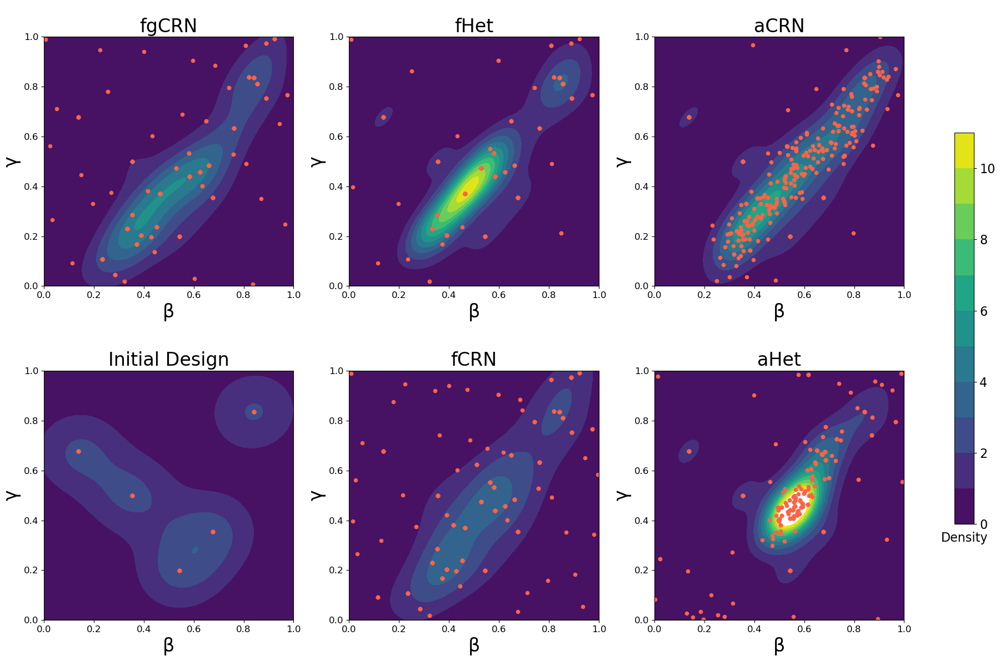{width="80%" fig-align="center"}


## Results: SIR Model

::: {.columns .two-wide-narrow-panel}
::: {.column}
**[aCRN]{.hl-orange} outperforms all baselines across thresholds and budgets**

At RMSE $< 15$ with budget = 500 simulations:

- [**aCRN:**]{.hl-orange} $\approx 25\%$ of trajectories below threshold
- [**fHet:**]{.hl-red} $\approx 15\%$ — best non-CRN comparator
- fCRN and fgCRN: lower still

[rAUC]{.hl-amber} is highest for [aCRN]{.hl-orange} at every threshold level.

**Parameter space coverage:**

- [fHet]{.hl-red} concentrates evaluations on a few grid points
- [aCRN]{.hl-orange} explores a broader region of $(\beta, \gamma)$ space
- Better coverage → more diverse calibrated trajectories
:::
::: {.column}
**Why does [adaptation]{.hl-green} help?**

- Early iterations identify promising $\theta$ regions
- Grid refinement focuses compute there
- Thompson Sampling naturally balances exploration vs. exploitation
- Fixed-grid methods waste budget on uninformative regions
:::
:::

## Experiment: CityCOVID Agent-Based Model

**Scaling up to a real, expensive ABM**

::: {.columns}
::: {.column width="55%"}
[**CityCOVID**]{.hl-blue} simulates $\approx 2.7$ million agents in Chicago

- Agents have realistic activity schedules (home, work, school, community)
- COVID-19 transmission via contact networks
- Validated against Chicago public health data

**Three calibration parameters:**

- $\theta_1$: susceptibility probability $\in [0.01, 0.15]$
- $\theta_2$: stay-at-home compliance $\in [0.1, 1]$
- $\theta_3$: behavioral adjustment $\in [0.01, 0.5]$

**Target data:** Daily deaths + hospitalizations, Chicago, April–June 2020
:::
::: {.column width="45%"}
**Computational setup:**

- Budget: [**3,000 simulations**]{.hl-amber} total
- Initial design: 20 parameter points × 30 replicates (600 runs)
- Each simulation: run on Argonne HPC via EMEWS framework


:::
:::

## Results: CityCOVID

**[aCRN]{.hl-orange} finds dramatically more calibrated trajectories**

::: {.columns}
::: {.column width="60%"}
| Threshold | [aCRN]{.hl-orange} | [fHet]{.hl-red} |
|-----------|------|------|
| $L < 15$ | [**52 trajectories**]{.hl-orange} | 1 trajectory |
| $L < 20$ | [**149 trajectories**]{.hl-orange} | 53 trajectories |

Within the same compute budget of 3,000 simulations.

[**aCRN discovers 52× more high-quality trajectories at the tighter threshold.**]{.hl-orange}

:::
:::

## A Summary


- Works in $(\theta, r)$ space — [no information loss]{.hl-green} from averaging
- GP borrows strength across seeds via correlation [$\rho$]{.hl-amber}
- [Adaptive grid]{.hl-orange} tracks promising regions dynamically
- [Thompson Sampling]{.hl-orange} handles exploration-exploitation automatically
- Same simulator interface
- Parallelizable batch evaluation (HPC-friendly)

## Key Takeaways

1. [**Seeds matter.**]{.hl-amber} By treating them as inputs and we can get a richer calibration.

2. [**Trajectory ensembles**]{.hl-blue} Multiple plausible $(\theta, r)$ pairs give more accurate uncertainty quantification.

3. [**Trajectory continuation is natural.**]{.hl-green} Once we have calibrated $(\theta, r)$ pairs, extending the simulation as new data arrives is straightforward.

<br>

#### Limitations and Future Work

- [Fixed replicate set]{.hl-red} — seeds chosen at initialization, not adapted
- [Constant inter-seed correlation $\rho$]{.hl-red} — assumes uniform seed structure
- [Scalar output summaries]{.hl-red} — doesn't yet handle functional/multivariate outputs directly
- Grid size is a tuning parameter — requires some sensitivity analysis

## Conclusion

::: {.columns}
::: {.column width="65%"}
**Staying on Track: Efficient Trajectory Discovery with Adaptive Batch Sampling**

**Preprint:** [arxiv.org/abs/2510.18099](https://arxiv.org/abs/2510.18099)
:::
::: {.column width="35%"}
{width="40%"}
:::
:::

<br>

::: {#refs}
:::
